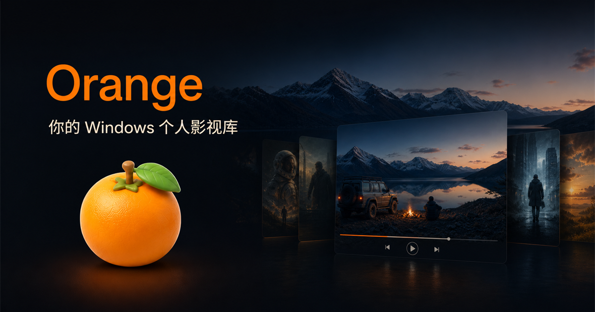

# Orange Player 产品介绍

> 一句话：Orange Player 是 Windows 上的个人影视库——连接你自己的媒体来源，自动整理成海报墙，再用一个不打扰的播放器看完。

**首选下载：[Microsoft Store · OrangePlayer](https://apps.microsoft.com/detail/9NTVLFKQM6LP?cid=orange_github_product&gl=CN&hl=zh-cn)**
（Windows 10 2004+ · 64 位，安装与更新由商店负责）

**用不了商店：[GitHub 安装包](INSTALL.md)**（Releases 里下载 setup.exe，双击安装、手动更新）

---

## 1. 适合谁

- 硬盘 / NAS / 网盘 / Plex / Emby 里存了不少影视内容，不想一个个文件夹翻的人
- 希望“搜一次就找到，不管片子存在哪”的人
- 想要一个深色、海报驱动、键盘优先、不弹窗打扰的 Windows 播放体验的人

不适合：寻找在线片源、云端转码服务、手机 / macOS 客户端的人（Orange Player 是 Windows 本地整理 + 播放工具）。

---

## 2. 核心能力：Orange Player All in One

传统方式：先想“这部片存在哪块盘 / 哪个网盘 / 哪台服务器”，再去对应位置找。

Orange Player 方式：**连接一次，搜索一次**。

1. **连接**：添加本地文件夹、百度网盘、阿里云盘、WebDAV、FTP、SMB / NAS、Plex、Emby。
2. **搜索**：在标题栏输入一次，所有已连接来源同时响应，结果按来源分组，写清清晰度、字幕与进度。
3. **继续**：打开详情或直接播放；远端内容也可一键加入本地资料库。

官网有可交互的产品演示：[Orange Player 官网](https://orange-official-site-orange1-d2gaxdul7d814785d.webapps.tcloudbase.com/#all-in-one)。

---

## 3. 功能一览

### 媒体库

- 流媒体式首页：继续观看、最近添加、电影、剧集分区
- 海报优先，长文本换行但不挤压控制区
- 搜索与筛选高可见；全局搜索支持来源筛选、预览与取消
- 刮削：海报、年份、演员、分集信息；匹配不准可人工选候选
- 未匹配媒体自动提取视频画面做临时封面（不覆盖人工 / 专业封面）
- 外部视频：双击或拖放 `.mp4` / `.mkv` / `.mov` / `.avi` / `.m4v` / `.webm` / `.m2ts` / `.mts` 即可播放，可选“仅播放”或“后台入库”

### 详情页

- 海报 + 背景图 Hero，主播放按钮前置
- 次级信息收进折叠区；剧集与文件列表高密度但不杂乱
- 远端（Emby / Plex）详情可直接加入资料库

### 播放页（Now Playing）

- 应用内播放 overlay：标题、进度、播放 / 暂停、前后跳、音轨、字幕
- 音量、倍速、截图、本地字幕收进抽屉 / 更多菜单
- 多音轨、多字幕、外挂字幕加载；断点续播；多文件队列
- 画中画：独立置顶小窗，可缩放，带播放 / 暂停与前后 15 秒
- 键盘优先，控制层自动隐藏；窄窗口不重叠，宽屏不空洞；高 DPI 下画面约束在播放区内

### 媒体源

- 本地文件夹、百度网盘（设备码授权）、阿里云盘、WebDAV、FTP、SMB、Plex、Emby
- 凭据走 Windows Credential Manager，不写普通配置文件
- 索引状态与失败隔离可见（哪个源卡住不影响别的源）

### 设置（运行状态中心）

- 外观、媒体库、播放器、字幕与音轨、诊断、关于
- 可查百度授权、播放器、数据库与故障信息；可调外部视频处理方式（双击 / 拖放行为）

---

## 4. 隐私：默认本地

- 媒体库、播放进度、列表、设置、海报 / 字幕 / 截图 / 日志默认在本机（通常 `%APPDATA%\Orange\`）
- 不上传原始视频文件；完整日志不自动上传
- 只有当你主动连接第三方媒体源、登录账号或启用云备份时，相关数据才会发给对应服务
- 官网统计无 Cookie、无访客标识，只记枚举事件（类型 / 页面 / 入口 / Campaign）
- 完整条款见官网 [隐私政策](https://orange-official-site-orange1-d2gaxdul7d814785d.webapps.tcloudbase.com/privacy)

---

## 5. 当前版本与诚实边界

- **当前版本 1.0.4.0**（桌面体验版，已在 Microsoft Store 上架）：
  - 全局搜索（本地 + Emby / Plex 远端）、外部视频打开与文件关联、画中画、设置与播放体验优化
- **1.0.4.0 默认关闭**：Orange Cloud 登录、云端备份、增量同步、应用内反馈、Plus / 推荐人入口；微信扫码登录保持关闭
- 简体中文为完整支持语言；`zh-Hant` / `en-US` / `de-DE` / `es-ES` / `fr-FR` / `ja-JP` / `ko-KR` 资源随包提供，仍在逐页验收
- 我们不会把未验收的云端能力包装成“已上线”宣传；开放节奏见后续版本说明

---

## 6. 支持一下

如果你喜欢 Orange Player：

1. 去 [Microsoft Store](https://apps.microsoft.com/detail/9NTVLFKQM6LP?cid=orange_github_product&gl=CN&hl=zh-cn) 点个五星、留一句话（比如哪类媒体源 + 哪种播放场景最顺）
2. 把官网发给同样有 NAS / 网盘 / Plex / Emby 的朋友：[Orange Player 官网](https://orange-official-site-orange1-d2gaxdul7d814785d.webapps.tcloudbase.com/)
3. 遇到问题先看 [支持中心](https://orange-official-site-orange1-d2gaxdul7d814785d.webapps.tcloudbase.com/support)，再到本仓库提 Issue——带上版本、复现步骤与预期结果，就是最有用的支持

遇到安全问题请走 [SECURITY.md](SECURITY.md)，不要发公开 Issue。
